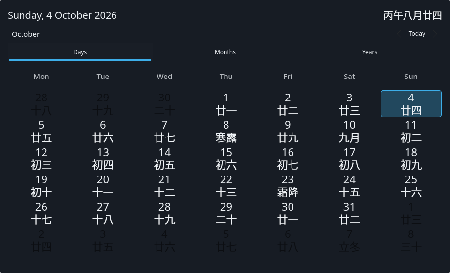
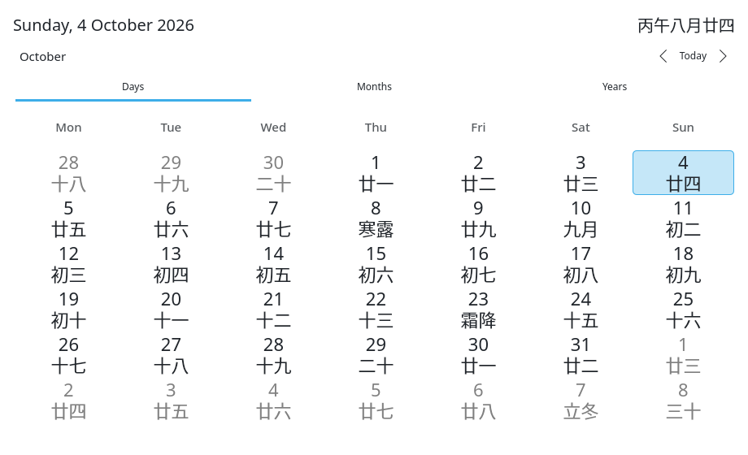

# Almanac

A Plasma 6 desktop widget showing Gregorian dates alongside an alternate calendar. Chinese lunar dates are the v1 default and the only alternate system covered by tests. The widget uses Plasma's generic calendar plugin, so other available systems also work without calendar-specific code.




Almanac starts by following today. It checks the local date every minute and when application state changes, including after suspend. Selecting another date preserves that selection and the visible month while today's highlight continues to advance. Click **Today** to resume following. There is no events pane; only the alternate-calendar plugin is enabled.

## Install

Requires Plasma 6, its workspace calendar QML module and alternate-calendar plugin, Python 3 (packaging only), `kpackagetool6`, and optionally `kbuildsycoca6`.

```sh
make install
```

Add **Almanac** from Plasma's widget picker. On the desktop it displays the full calendar; in a panel it displays a date icon opening the same calendar. The popup's pin button keeps it open when focus changes.

In **Configure Almanac → General**, choose System, Light, or Dark, desktop opacity, week numbers, and popup pinning. The **Calendar system** section loads Plasma's own plugin settings. Select **Chinese** for lunar dates. Existing calendar settings are respected.

**Calendar system and date offset are shared with the panel clock**, stored in `~/.config/plasma_calendar_alternatecalendar`. Almanac does not overwrite that file on install. Changing the setting affects every widget using the plugin. On a system without a saved Chinese preference, select Chinese in settings. Widget-local calendar systems and multiple alternate rows are outside v1.

## Develop and verify

```sh
make test        # offscreen unit and real Plasma calendar/config integration tests
make lint        # Qt qmllint; requires Plasma/Kirigami QML imports
make package     # dist/almanac.plasmoid
make screenshots # regenerate dark/light screenshots from the real QML view
```

Qt tools are resolved from PATH with `/usr/lib/qt6/bin` fallbacks. Tests use disposable configuration and cache directories, a Chinese calendar preference, and software rendering; they do not alter desktop settings. CI uses Arch Linux for Plasma 6 tooling. Release tags `v*` build the plasmoid archive.

The integration test injects `CalendarView.clockSource`, advances the date, verifies selection and highlight dates, clicks a real calendar cell, checks the visible month stays selected, and clicks the native Today button to resume following. It also verifies `丙午八月廿四` for 4 October 2026 and loads the plugin's config UI through `EventPluginsManager.model`. Screenshots are offscreen renders of this same view rather than desktop captures.

After installation, verify desktop resizing, lunar cell labels, navigation, the config dialog's Apply action, and panel popup pinning in your Plasma session.

Licensed under MIT. Plasma's calendar implementation and plugin remain supplied by KDE and are not bundled.
